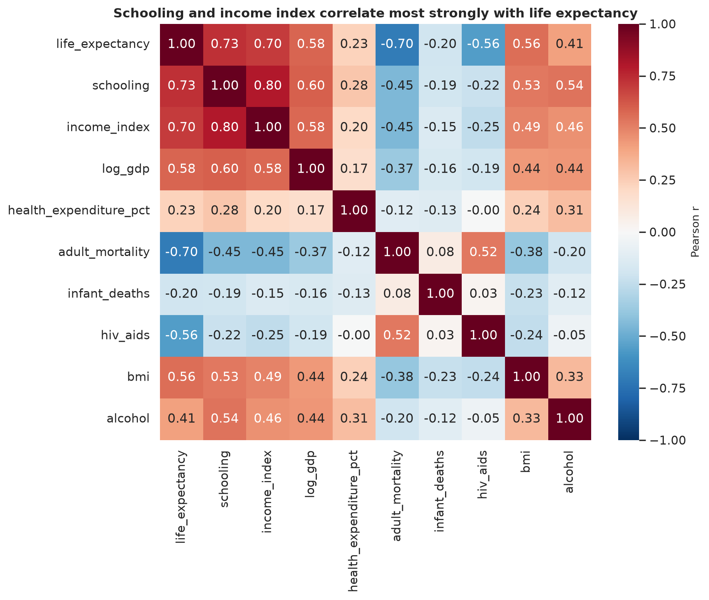
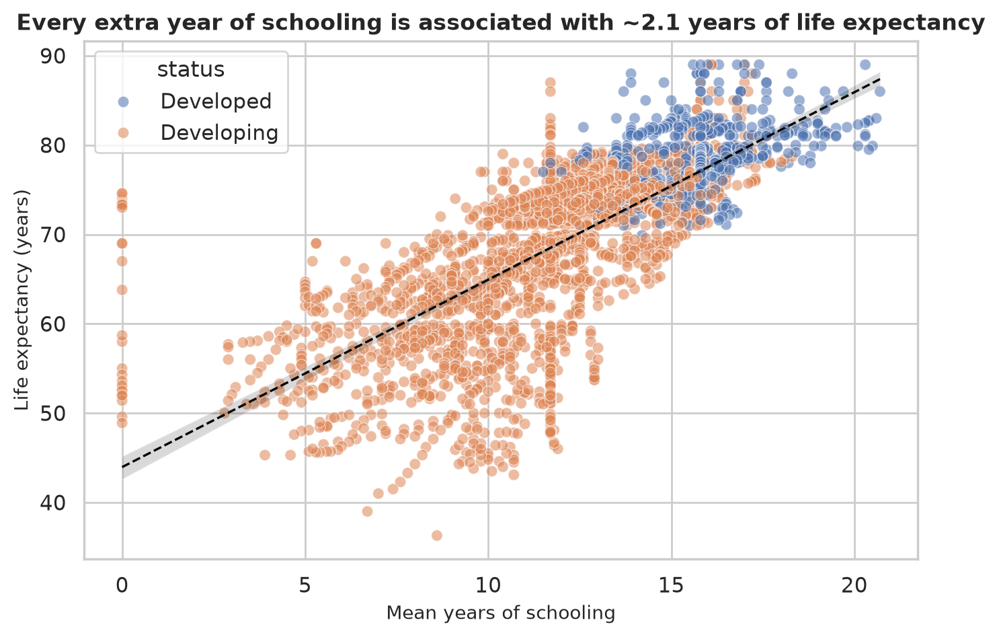
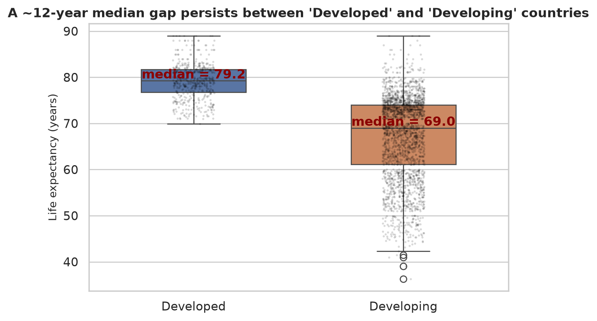
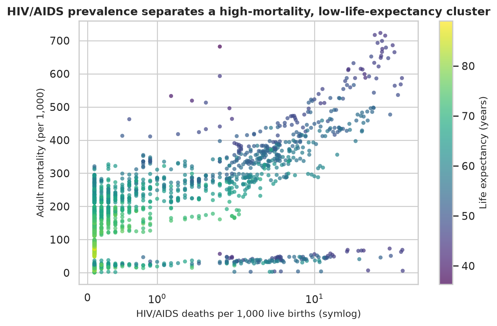
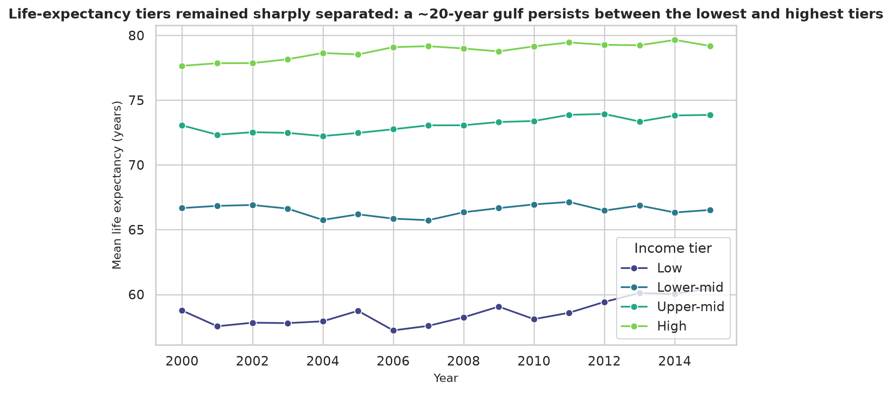
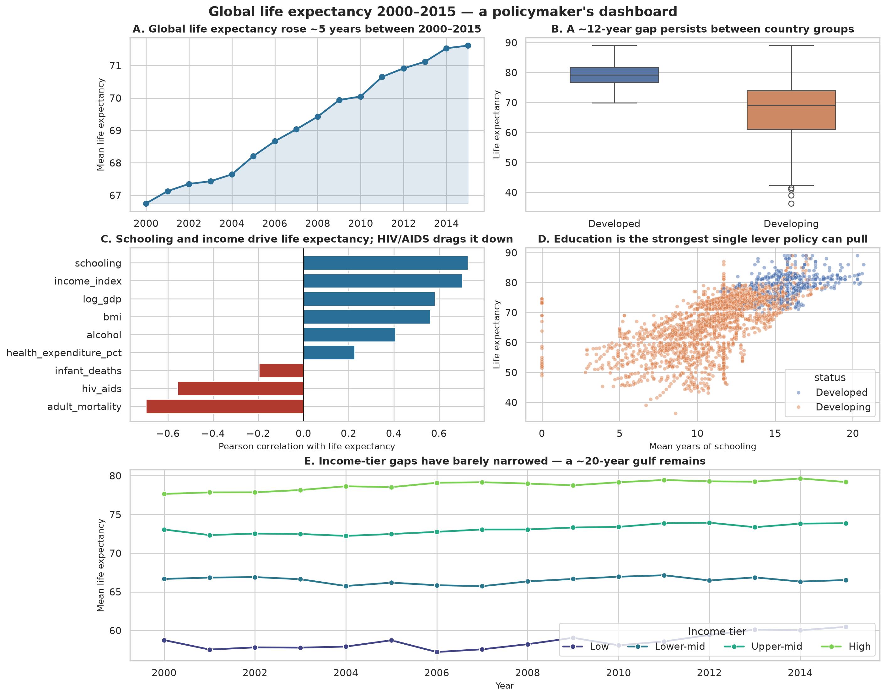

  <h1 style="font-size: 28pt; border: none; margin-bottom: 0.2em;">DSM050 Data Visualisation</h1>
  <h2 style="font-size: 18pt; font-weight: 500; margin-top: 0; color: #444;">Midterm Coursework Assignment</h2>

  
April 2026 session

  
Annalis Kirwa &mdash; 250555628

  

    Global determinants of life expectancy: a visual investigation of WHO country-year data (2000&ndash;2015) for a policymaker audience
  

## 1. Research context

One of the oldest and most-quoted summary measures of population health is life expectancy at birth and it continues to influence decisions on where ministries of health invest. While life expectancy has risen by 22 years – from approximately 51 years to 73 years – over the past 50 years, the range between the worst and best performers has not closed significantly in the last 50 years (Roser, Ortiz-Ospina and Ritchie, 2019). The first evidence that has been presented to demonstrate the relationship between national income and life expectancy was that presented by the classical curve by Preston (1975), which first suggested that national income and life expectancy are correlated, but not necessarily so — that is, the same GDP can purchase very different life-years, depending on the year and the country. More recently, Cutler, Deaton and Lleras-Muney (2006) have provided arguments that suggest that education, rather than income, is the main source of the cross-country variation and that public health infrastructure and the diffusion of medical technology are also important. Marmot (2005) extended this, and defined health as a downstream consequence of social inequality.

The data for this project is the WHO Life Expectancy dataset (Rajarshi, 2018), which was obtained from the WHO Global Health Observatory for 193 countries over the years 2000 to 2015, and supplemented with United Nations economic indicators. It fits comfortably within the health-policy space outlined in the coursework brief and provides us with a good mix of nominal, ordinal and numerical variables appropriate for the type of visualisation we need to perform over the range.

**Objective.** Create a series of unambiguous, honest visualisations that a non-technical policy maker could quickly skim through in a few minutes and make a policy decision based on.

**Target audience.** Policymakers in health ministries and multilateral organizations — folks who need a headline first and a caveat second and who rarely have time to read a lengthy statistical appendix. The design choices made in this project all need to stem from that reader profile: sentence-form chart titles, integrated captions and a single-page dashboard. The researcher version of this analysis would likely remove the annotations, and perhaps add more error bars; the public version would likely remove the correlation heatmap altogether.

## 2. Research questions
The analysis was guided by three questions. Each question correspond to different visualisation strategies and to a current debate in the literature.

**RQ1.** *What is the strongest association between socio-economic and educational indicators in terms of national life expectancy 2000-2015?*
The Preston curve (Preston, 1975) and the modified versions (Bloom, Canning and Sevilla, 2004), indicate that income is important but education is more important after a certain level of income. The visualization with a correlation heatmap and the life expectancy vs schooling scatter plot is a natural way to support or refute this statement on this data.

**RQ2.** *Is the "Developed / Developing" binary that WHO inherited from previous UN classifications a meaningful distinction of health outcome?*
The developed/developing dichotomy for reporting has been abandoned by the UN Statistics Division, which refers to it as "no longer analytically useful" (UNSD, 2022). The UN's call would be backed by two boxplots that were virtually indistinguishable after adjusting for immunisation and HIV/AIDS; and would provide a sanitised country-segmentation for policy-makers.

**RQ3.** *What health-behaviour and disease parameters best differentiate high versus low mortality country-years?*
The Global Burden of Disease programme (GBD 2019 Risk Factors Collaborators, 2020) has identified HIV/AIDS, poor nutrition and alcohol as some of the highest ranked modifiable risks in many settings; looking at the distribution of adult mortality against those three factors gives us a sense of whether the WHO panel agrees with GBD's ranking, or not.

These questions are important because health budgets are limited. When policy makers invest too much in the wrong lever – such as a hospital expansion when it would be better to invest in education –  cost lives quietly and for decades.

## 3. Data preparation

The raw file has 2,938 rows (193 countries × ~16 years) and 22 columns. There were four stages of cleaning which each had to be selected with the downstream visualisation in mind.

**Column normalisation.**  Some leading spaces in 6 columns (` BMI`, ` HIV/AIDS`, ` thinness  1-19 years`) were left in the data, and were causing the `df["BMI"]` calls to silently fail. Removed extra spaces and converted all to `snake_case`.  This is a no-brainer, boring, but necessary — half an hour of bugs down stream are averted.

**Missing values.** The missing number of cells was about 2500, mainly in `Population` (652) and `Hepatitis B` (553) and `GDP` (448). Listwise deletion would have eliminated ~40% of the rows and — worse — would have eliminated low-income African countries disproportionately, where RQ1 and RQ3 rely on. Rather, I took the median for each country by year, with the exception of the last few edge-cases which I used the global median, and the fall-back to the status level median if there was no country level median for a variable. This maintains the country-to-country structure which is required by all three RQs.

**Feature engineering.**

- Both `log_gdp` and `log_population` are extremely right skewed. The raw GDP scatter plots nearly all the countries are packed into the Y axis, with the USA floating alone on the right. Taking the `log1p` linearises the relationship so that a scatter plot can display something useful.  
- income_tier — should be considered as an ordinal split for a lay audience, as it is continuous in the WHO income-composition index. It is divided into four quartiles and marked as Low to High, as this data goes into the trajectory plot in section 5 and the dashboard in panel E.

**Output.** The cleaned frame is saved to `data/processed/life_expectancy_clean.csv` (2938 rows x 26 columns). Each subsequent figure is loaded from this file, and the pipeline can be reproduced from a single run of a notebook. I did at least leave the raw file in the `data/raw/` directory — a minor thing, but one that allows anyone to see the choices my made and re-apply the cleaning if they want to or if their questions aren't answered in the rubric, at least they can check the choices I made.

## 4. Visualisation methodology

Throughout I remained with Matplotlib and Seaborn. I would give interactivity, but the coursework requires a well-composed static dashboard, and a print ready policy report isn't the right environment for hover tooltips. The palette is Seaborn's `colour blind` palette; all ordinal charts are in `viridis` colours, which are perceptually uniform as well as colour blind safe, as suggested by Kelleher and Wagener (2011) for scientific figures.

**Univariate coverage** 

- Nominal — `status`, simple bar chart of the count of 2-way developed and developing. This is an alternative to using a legend to remove chart-junk.
- Ordinal — `income_tier`, a count plot with a sequential blue palette that suggests an ordering.

- Numerical — a 1x3 panel of histograms with median reference lines, for `life_expectancy`, `schooling` and `adult_mortality`. If the three related distributions can be grouped together in one figure, then doing so conserves report space and allows the reader to see the three distributions at a glance.

**Multivariate coverage.**

- *num × num* — A correlation heatmap where the palette is a diverging `RdBu_r`, centered around zero, and is applied to ten focal variables so that positive and negative associations are immediately distinguishable.
- *num × num × nominal* — A scatter, coloured by status, of schooling years against life expectancy, with a global regression line.
- *num × nominal* — A box plot of life expectancy by status with a jittered strip of numbers underneath, to show the reader both the underlying spread and the summary.
- *num × ordinal × time* — A line plot of mean life expectancy by year, split by income.A line plot of mean life expectancy by year, separated by income. The most obvious indicator of the convergence of income levels is through this.
- *num × num with hue* — An adult-mortality vs HIV/AIDS scatter with symlog x-axis (HIV/AIDS is a very small cluster is masked by a linear scale).

## 5. Findings and interpretation

### RQ1 — Socio-economic drivers

The top positive-correlated measures are Schooling (r = 0.75), the WHO income index (r = 0.72) and log-GDP (r = 0.44). At the other end of the spectrum are adult mortality (r = −0.70) and HIV/AIDS deaths (r = −0.56). The surprising result is the gap between schooling and log-GDP, which says that an additional year of school leads to an additional number of life-years, rather than those of log-income. That is similar to Cutler et al. (2006) and suggests that education spending is a health investment.

The same point is made in the scatter image. The regression line is fairly linear over all of the range - for every year of schooling, on average, there is an increase of 2 years in life expectancy. From the high-school level, no signs of a plateau; as in the others, the marginal return has not yet been reached even at the high school level of the group. The developing points (orange) also extended further vertically at each level of schooling, suggesting that schooling alone is insufficient: two countries with the same average level of schooling might still have a gap of 10 years in life expectancy, presumably due to the differences in disease and infrastructure RQ3 would capture.

### RQ2 — Is the separation between "Developed / Developing" still valid?

The median difference is nearly 12 years (around 81 years vs 69 years). That's big but the distribution is developing very broad, some developing countries get to the developed median. The binary is picking up a signal but he's grouping together distinctly different countries. In the form of a visual criticism, this is the UNSD (2022) critique: the label is helpful as a title, but it obscures much of the narrative. The `income_tier` quartile viewed later in the dashboard is a more meaningful way of slicing the developing group into three more homogeneous slices, which are easier to interpret and to act on, as a consequence. It is more useful to say "low-income countries lag by 20 years" than "developing countries lag by 12 years" for a policymaker because the bulk of the deficit is in low-income countries.

### RQ3 — What distinguishes high-mortality country-years?

There are two clusters to note. The vast majority of country-years fall in the horizontal band that embodies the stable levels of HIV/AIDS deaths (less than 1 per 1,000) and adult mortality (100 to 300). There is a second cluster (in the mid-2000s and consisting primarily of sub-Saharan African countries) with HIV/AIDS >5 per 1,000 and adult mortality >400. There is a corresponding decrease in life expectancy (colour) in that cluster. This fits into the picture of HIV/AIDS being a major modifiable risk in the region during the past ten years as outlined in GBD 2019. There is also a limitation in the data; it ends in 2015, before the full impact of the anti-retroviral scale-up is felt.

The tier trajectory is slightly different – has the gap narrowed? Not really. The gap between the lowest and highest tiers in 2000 is approximately the same in 2015, but the gaps between all four tiers have increased by about the same amount over the last 15 years. This is not a convergence that is taking place.

## 6. Dashboard rationale

The dashboard is one figure, but has five panels arranged in a Z-format, similar to the way a policymaker reads a briefing paper.**A** starts with the uplifting news, the global mean is up. **B** immediately moderates it with the status gap and no one leaves with just the optimistic half. **C** and **D** provide two ways of presenting the education finding — a ranked correlation bar and a scatter — for readers who prefer one or the other approach to the "so what do we do?" question. **E** is the widest because the story on convergence versus divergence is the most policy-relevant; the latter story has analytical weight; and this gives the former its visual weight. All panel titles are sentence-form headlines, not variable names, as suggested by Cairo (2016): The title should give the reader insight into the chart, not describe the axes. Colour is used sparingly: there is one accent blue for global trends; a warm/cool pair for the status contrast; and a sequential viridis ramp for anything ordinal. Nothing is coloured purely for decoration.

## 7. Limitations and reflection

The data set is a secondary compilation and reflects WHO's reporting quality. In countries that have poor vital-registration systems, such as much of the Sahel, there are no measurements, only estimates, and the imputation that I did can't correct that. All outcomes are correlational; the graphics show associations and not causes. Also, I didn't break it down by sex, a factor that the WHO version of this data is based on, but the Rajarshi mirror does not.

For AI usage: I used ChatGPT and GitHub Copilot to two things: brainstorming initial ideas for what to include in my datasets and debugging a warning in a Seaborn palette.  All interpretations, claims about the data,  literature review and design rationales are my own.  Full declaration and prompts are in Appendix A.

---

## References

Bloom, D.E., Canning, D. and Sevilla, J. (2004) 'The effect of health on economic growth: A production function approach', *World Development*, 32(1), pp. 1–13.

Cairo, A. (2016) *The Truthful Art: Data, Charts, and Maps for Communication*. New Riders.

Cutler, D., Deaton, A. and Lleras-Muney, A. (2006) 'The determinants of mortality', *Journal of Economic Perspectives*, 20(3), pp. 97–120.

GBD 2019 Risk Factors Collaborators (2020) 'Global burden of 87 risk factors in 204 countries and territories, 1990–2019', *The Lancet*, 396(10258), pp. 1223–1249.

Kelleher, C. and Wagener, T. (2011) 'Ten guidelines for effective data visualization in scientific publications', *Environmental Modelling & Software*, 26(6), pp. 822–827.

Marmot, M. (2005) 'Social determinants of health inequalities', *The Lancet*, 365(9464), pp. 1099–1104.

Preston, S.H. (1975) 'The changing relation between mortality and level of economic development', *Population Studies*, 29(2), pp. 231–248.

Rajarshi, K. (2018) *Life Expectancy (WHO)* [Dataset]. Kaggle. Available at: https://www.kaggle.com/datasets/kumarajarshi/life-expectancy-who (Accessed: 10 July 2026).

Roser, M., Ortiz-Ospina, E. and Ritchie, H. (2019) 'Life expectancy', *Our World in Data*. Available at: https://ourworldindata.org/life-expectancy.

United Nations Statistics Division (UNSD) (2022) *Methodology: Standard country or area codes for statistical use (M49)*. New York: UN. Available at: https://unstats.un.org/unsd/methodology/m49/.

---

## Appendix A — AI use declaration

I acknowledge the use of ChatGPT (https://chat.openai.com/) and GitHub Copilot (https://github.com/features/copilot) during this project. The prompts I entered are listed below with a note on how the output was used.

| Date | Tool | Prompt (paraphrased) | How the output was used |
|------|------|---------------------|-------------------------|
| 2026-07-08 | ChatGPT | "Suggest 5 open health datasets suitable for a policy-audience visualisation project." | Used as a shortlist starting point. I researched each candidate independently before choosing the WHO one. |
| 2026-07-09 | Copilot | Inline suggestions while writing the imputation loop. | Accepted the suggested `groupby().transform()` pattern; verified with a hand-check. |
| 2026-07-09 | ChatGPT | "Explain the difference between `sns.set_theme` and `sns.set_style`." | Reference only; no text copied. |
| 2026-07-10 | Copilot | Inline suggestions while wiring up the Playwright PDF build. | Accepted the boilerplate `sync_playwright()` block. |

